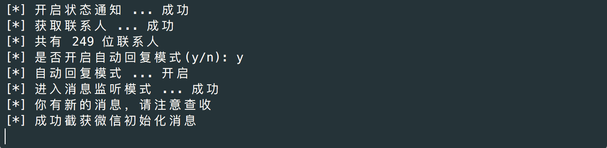
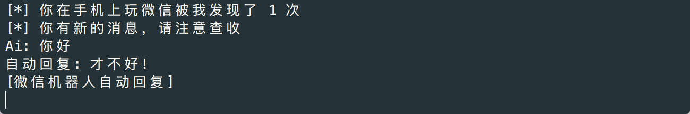
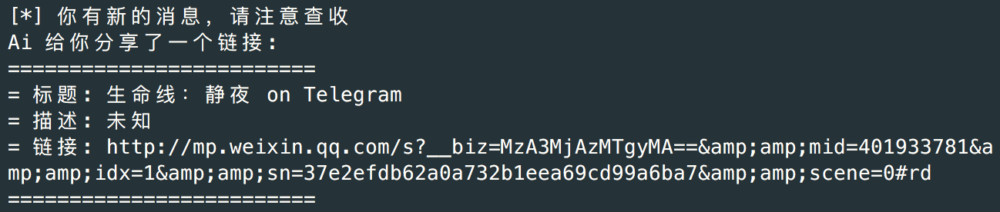
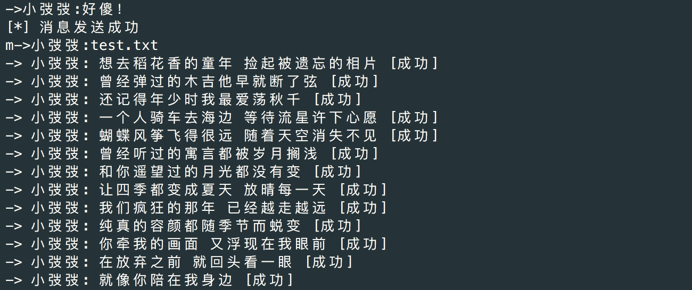
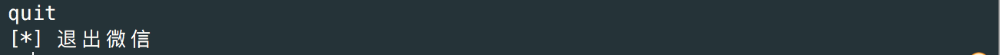

# WeixinBot [](http://github.com/Urinx/WeixinBot) [](http://github.com/Urinx/WeixinBot/fork) 

网页版微信API，包含终端版微信及微信机器人

## Demo
为了运行 `weixin.py` 示例脚本，你需要有安装 `qrcode` 包，你可以通过 `pip install qrcode` 来安装。


按照操作指示在手机微信上扫描二维码然后登录，你可以选择是否开启自动回复模式。



开启自动回复模式后，如果接收到的是文字消息就会自动回复，包括群消息。



现在，名片，链接，动画表情和地址位置消息都可以正常接收。




**目前支持的命令**：

`->[昵称或ID]:[内容]` 给好友发送消息

`m->[昵称或ID]:[文件路径]` 给好友发送文件中的内容



`f->[昵称或ID]:[文件路径]` 给好友发送文件

`i->[昵称或ID]:[图片路径]` 给好友发送图片

`quit` 退出程序



注意，以上命令均不包含方括号。

## Web Weixin Pipeline

```
       +--------------+     +---------------+   +---------------+
       |              |     |               |   |               |
       |   Get UUID   |     |  Get Contact  |   | Status Notify |
       |              |     |               |   |               |
       +-------+------+     +-------^-------+   +-------^-------+
               |                    |                   |
               |                    +-------+  +--------+
               |                            |  |
       +-------v------+               +-----+--+------+      +--------------+
       |              |               |               |      |              |
       |  Get QRCode  |               |  Weixin Init  +------>  Sync Check  <----+
       |              |               |               |      |              |    |
       +-------+------+               +-------^-------+      +-------+------+    |
               |                              |                      |           |
               |                              |                      +-----------+
               |                              |                      |
       +-------v------+               +-------+--------+     +-------v-------+
       |              | Confirm Login |                |     |               |
+------>    Login     +---------------> New Login Page |     |  Weixin Sync  |
|      |              |               |                |     |               |
|      +------+-------+               +----------------+     +---------------+
|             |
|QRCode Scaned|
+-------------+
```

## Web Weixin API

### 登录

| API | 获取 UUID |
| --- | --------- |
| url | https://login.weixin.qq.com/jslogin |
| method | POST |
| data | URL Encode |
| params | **appid**: `应用ID` <br> **fun**: new `应用类型` <br> **lang**: zh\_CN `语言` <br> **_**: `时间戳` |

返回数据(String):
```
window.QRLogin.code = 200; window.QRLogin.uuid = "xxx"
```
<br>

| API | 生成二维码 |
| --- | --------- |
| url | https://login.weixin.qq.com/l/ `uuid` |
<br>

| API | 二维码扫描登录 |
| --- | --------- |
| url | https://login.weixin.qq.com/cgi-bin/mmwebwx-bin/login |
| method | GET |
| params | **tip**: 1 `未扫描` 0 `已扫描` <br> **uuid**: xxx <br> **_**: `时间戳` |

返回数据(String):
```
window.code=xxx;

xxx:
	408 登陆超时
	201 扫描成功
	200 确认登录

当返回200时，还会有
window.redirect_uri="https://wx.qq.com/cgi-bin/mmwebwx-bin/webwxnewloginpage?ticket=xxx&uuid=xxx&lang=xxx&scan=xxx";
```
<br>

| API | webwxnewloginpage |
| --- | --------- |
| url | https://wx.qq.com/cgi-bin/mmwebwx-bin/webwxnewloginpage |
| method | GET |
| params | **ticket**: xxx <br> **uuid**: xxx <br> **lang**: zh_CN `语言` <br> **scan**: xxx <br> **fun**: new |

返回数据(XML):
```
<error>
	<ret>0</ret>
	<message>OK</message>
	<skey>xxx</skey>
	<wxsid>xxx</wxsid>
	<wxuin>xxx</wxuin>
	<pass_ticket>xxx</pass_ticket>
	<isgrayscale>1</isgrayscale>
</error>
```
<br>

### 微信初始化

| API | webwxinit |
| --- | --------- |
| url | https://wx.qq.com/cgi-bin/mmwebwx-bin/webwxinit?pass_ticket=xxx&skey=xxx&r=xxx |
| method | POST |
| data | JSON |
| header | ContentType: application/json; charset=UTF-8 |
| params | { <br> &nbsp;&nbsp;&nbsp;&nbsp; BaseRequest: { <br> &nbsp;&nbsp;&nbsp;&nbsp;&nbsp;&nbsp;&nbsp;&nbsp;	Uin: xxx, <br>	&nbsp;&nbsp;&nbsp;&nbsp;&nbsp;&nbsp;&nbsp;&nbsp; Sid: xxx, <br> &nbsp;&nbsp;&nbsp;&nbsp;&nbsp;&nbsp;&nbsp;&nbsp;	Skey: xxx, <br> &nbsp;&nbsp;&nbsp;&nbsp;&nbsp;&nbsp;&nbsp;&nbsp; DeviceID: xxx, <br> &nbsp;&nbsp;&nbsp;&nbsp; } <br> } |

返回数据(JSON):
```
{
	"BaseResponse": {
		"Ret": 0,
		"ErrMsg": ""
	},
	"Count": 11,
	"ContactList": [...],
	"SyncKey": {
		"Count": 4,
		"List": [
			{
				"Key": 1,
				"Val": 635705559
			},
			...
		]
	},
	"User": {
		"Uin": xxx,
		"UserName": xxx,
		"NickName": xxx,
		"HeadImgUrl": xxx,
		"RemarkName": "",
		"PYInitial": "",
		"PYQuanPin": "",
		"RemarkPYInitial": "",
		"RemarkPYQuanPin": "",
		"HideInputBarFlag": 0,
		"StarFriend": 0,
		"Sex": 1,
		"Signature": "Apt-get install B",
		"AppAccountFlag": 0,
		"VerifyFlag": 0,
		"ContactFlag": 0,
		"WebWxPluginSwitch": 0,
		"HeadImgFlag": 1,
		"SnsFlag": 17
	},
	"ChatSet": xxx,
	"SKey": xxx,
	"ClientVersion": 369297683,
	"SystemTime": 1453124908,
	"GrayScale": 1,
	"InviteStartCount": 40,
	"MPSubscribeMsgCount": 2,
	"MPSubscribeMsgList": [...],
	"ClickReportInterval": 600000
}
```
<br>

| API | webwxstatusnotify |
| --- | --------- |
| url | https://wx.qq.com/cgi-bin/mmwebwx-bin/webwxstatusnotify?lang=zh_CN&pass_ticket=xxx |
| method | POST |
| data | JSON |
| header | ContentType: application/json; charset=UTF-8 |
| params | { <br> &nbsp;&nbsp;&nbsp;&nbsp; BaseRequest: { Uin: xxx, Sid: xxx, Skey: xxx, DeviceID: xxx }, <br> &nbsp;&nbsp;&nbsp;&nbsp; Code: 3, <br> &nbsp;&nbsp;&nbsp;&nbsp; FromUserName: `自己ID`, <br> &nbsp;&nbsp;&nbsp;&nbsp; ToUserName: `自己ID`, <br> &nbsp;&nbsp;&nbsp;&nbsp; ClientMsgId: `时间戳` <br> } |

返回数据(JSON):
```
{
	"BaseResponse": {
		"Ret": 0,
		"ErrMsg": ""
	},
	...
}
```
<br>

### 获取联系人信息

| API | webwxgetcontact |
| --- | --------- |
| url | https://wx.qq.com/cgi-bin/mmwebwx-bin//webwxgetcontact?pass_ticket=xxx&skey=xxx&r=xxx |
| method | POST |
| data | JSON |
| header | ContentType: application/json; charset=UTF-8 |

返回数据(JSON):
```
{
	"BaseResponse": {
		"Ret": 0,
		"ErrMsg": ""
	},
	"MemberCount": 334,
	"MemberList": [
		{
			"Uin": 0,
			"UserName": xxx,
			"NickName": "Urinx",
			"HeadImgUrl": xxx,
			"ContactFlag": 3,
			"MemberCount": 0,
			"MemberList": [],
			"RemarkName": "",
			"HideInputBarFlag": 0,
			"Sex": 0,
			"Signature": "你好，我们是地球三体组织。在这里，你将感受到不一样的思维模式，以及颠覆常规的世界观。而我们的目标，就是以三体人的智慧，引领人类未来科学技术500年。",
			"VerifyFlag": 8,
			"OwnerUin": 0,
			"PYInitial": "URINX",
			"PYQuanPin": "Urinx",
			"RemarkPYInitial": "",
			"RemarkPYQuanPin": "",
			"StarFriend": 0,
			"AppAccountFlag": 0,
			"Statues": 0,
			"AttrStatus": 0,
			"Province": "",
			"City": "",
			"Alias": "Urinxs",
			"SnsFlag": 0,
			"UniFriend": 0,
			"DisplayName": "",
			"ChatRoomId": 0,
			"KeyWord": "gh_",
			"EncryChatRoomId": ""
		},
		...
	],
	"Seq": 0
}
```
<br>

| API | webwxbatchgetcontact |
| --- | --------- |
| url | https://wx.qq.com/cgi-bin/mmwebwx-bin/webwxbatchgetcontact?type=ex&r=xxx&pass_ticket=xxx |
| method | POST |
| data | JSON |
| header | ContentType: application/json; charset=UTF-8 |
| params | { <br> &nbsp;&nbsp;&nbsp;&nbsp; BaseRequest: { Uin: xxx, Sid: xxx, Skey: xxx, DeviceID: xxx }, <br> &nbsp;&nbsp;&nbsp;&nbsp; Count: `群数量`, <br> &nbsp;&nbsp;&nbsp;&nbsp; List: [ <br> &nbsp;&nbsp;&nbsp;&nbsp;&nbsp;&nbsp;&nbsp;&nbsp; { UserName: `群ID`, EncryChatRoomId: "" }, <br> &nbsp;&nbsp;&nbsp;&nbsp;&nbsp;&nbsp;&nbsp;&nbsp; ... <br> &nbsp;&nbsp;&nbsp;&nbsp; ], <br> } |

返回数据(JSON)同上
<br><br>

### 同步刷新

| API | synccheck |
| --- | --------- |
| url | https://webpush.weixin.qq.com/cgi-bin/mmwebwx-bin/synccheck or <br> https://webpush2.weixin.qq.com/cgi-bin/mmwebwx-bin/synccheck |
| method | GET |
| data | URL Encode |
| params | **r**: `时间戳` <br> **sid**: xxx <br> **uin**: xxx <br> **skey**: xxx <br> **deviceid**: xxx <br> **synckey**: xxx <br> **_**: `时间戳` |

返回数据(String):
```
window.synccheck={retcode:"xxx",selector:"xxx"}

retcode:
	0 正常
	1100 失败/登出微信
selector:
	0 正常
	2 新的消息
	7 进入/离开聊天界面
```
<br>

| API | webwxsync |
| --- | --------- |
| url | https://wx.qq.com/cgi-bin/mmwebwx-bin/webwxsync?sid=xxx&skey=xxx&pass_ticket=xxx |
| method | POST |
| data | JSON |
| header | ContentType: application/json; charset=UTF-8 |
| params | { <br> &nbsp;&nbsp;&nbsp;&nbsp; BaseRequest: { Uin: xxx, Sid: xxx, Skey: xxx, DeviceID: xxx }, <br> &nbsp;&nbsp;&nbsp;&nbsp; SyncKey: xxx, <br> &nbsp;&nbsp;&nbsp;&nbsp; rr: `时间戳取反` <br> } |

返回数据(JSON):
```
{
	'BaseResponse': {'ErrMsg': '', 'Ret': 0},
	'SyncKey': {
		'Count': 7,
		'List': [
			{'Val': 636214192, 'Key': 1},
			...
		]
	},
	'ContinueFlag': 0,
	'AddMsgCount': 1,
	'AddMsgList': [
		{
			'FromUserName': '',
			'PlayLength': 0,
			'RecommendInfo': {...},
			'Content': "", 
			'StatusNotifyUserName': '',
			'StatusNotifyCode': 5,
			'Status': 3,
			'VoiceLength': 0,
			'ToUserName': '',
			'ForwardFlag': 0,
			'AppMsgType': 0,
			'AppInfo': {'Type': 0, 'AppID': ''},
			'Url': '',
			'ImgStatus': 1,
			'MsgType': 51,
			'ImgHeight': 0,
			'MediaId': '', 
			'FileName': '',
			'FileSize': '',
			...
		},
		...
	],
	'ModChatRoomMemberCount': 0,
	'ModContactList': [],
	'DelContactList': [],
	'ModChatRoomMemberList': [],
	'DelContactCount': 0,
	...
}
```
<br>

### 消息接口

| API | webwxsendmsg |
| --- | --------- |
| url | https://wx.qq.com/cgi-bin/mmwebwx-bin/webwxsendmsg?pass_ticket=xxx |
| method | POST |
| data | JSON |
| header | ContentType: application/json; charset=UTF-8 |
| params | { <br> &nbsp;&nbsp;&nbsp;&nbsp; BaseRequest: { Uin: xxx, Sid: xxx, Skey: xxx, DeviceID: xxx }, <br> &nbsp;&nbsp;&nbsp;&nbsp; Msg: { <br> &nbsp;&nbsp;&nbsp;&nbsp;&nbsp;&nbsp;&nbsp;&nbsp; Type: 1 `文字消息`, <br> &nbsp;&nbsp;&nbsp;&nbsp;&nbsp;&nbsp;&nbsp;&nbsp; Content: `要发送的消息`, <br> &nbsp;&nbsp;&nbsp;&nbsp;&nbsp;&nbsp;&nbsp;&nbsp; FromUserName: `自己ID`, <br> &nbsp;&nbsp;&nbsp;&nbsp;&nbsp;&nbsp;&nbsp;&nbsp; ToUserName: `好友ID`, <br> &nbsp;&nbsp;&nbsp;&nbsp;&nbsp;&nbsp;&nbsp;&nbsp; LocalID: `与clientMsgId相同`, <br> &nbsp;&nbsp;&nbsp;&nbsp;&nbsp;&nbsp;&nbsp;&nbsp; ClientMsgId: `时间戳左移4位随后补上4位随机数` <br> &nbsp;&nbsp;&nbsp;&nbsp; } <br> } |

返回数据(JSON):
```
{
	"BaseResponse": {
		"Ret": 0,
		"ErrMsg": ""
	},
	...
}
```
